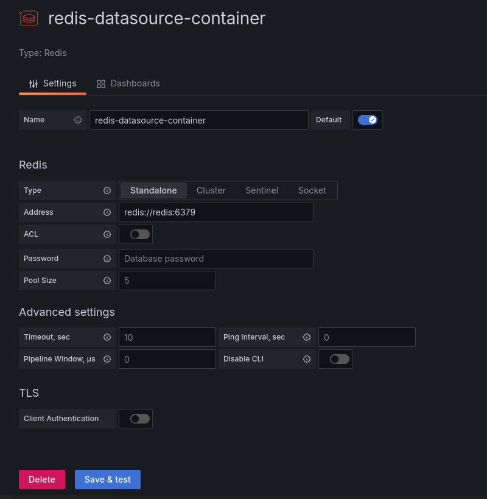
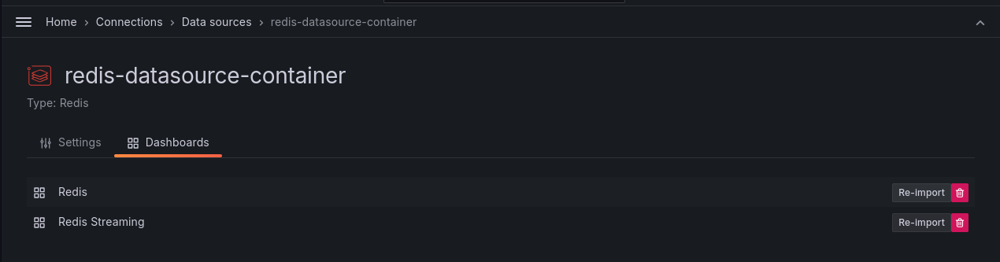
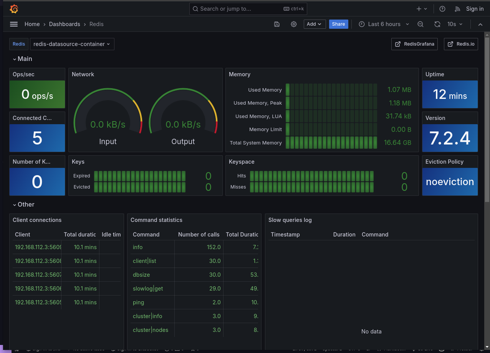

- suba os containers
```
docker-compose up -d
```

- acesse o grafana no navegador
```
http://localhost:3000
```

- vá em `Menu` -> `Data Sources` -> `Add data source` -> `Redis`

- configure o Address
```
redis://redis:6379
```


- importe os dashboards



- agora vá em `Menu` -> `Dashboards` -> `Redis` e selecione o dashboard desejado

